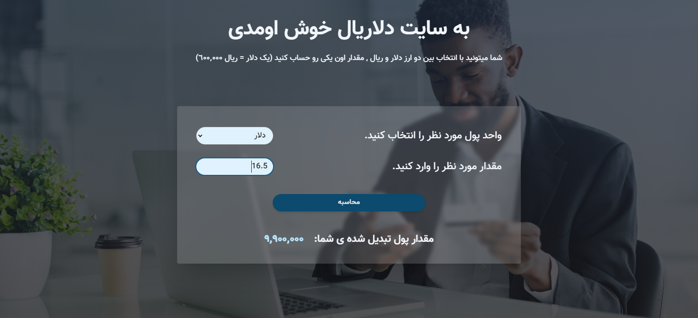

# 💲DollaRial Responsive Website
### **Built with : React (Vite) , TypeScript , Tailwind CSS**
## Description
In this Website, you can calculate your desired amount of money between these two currencies, Dollar($) and Rial(ريال)
#### Also you can use this website on smaller screens such as Tablet and Mobile, because its **Fully Responsive** 😊

## Website Page


## Getting Started
to start the project, run :
```
npm i
npm run dev
```
the project will be available on port 5173 of localhost by default

